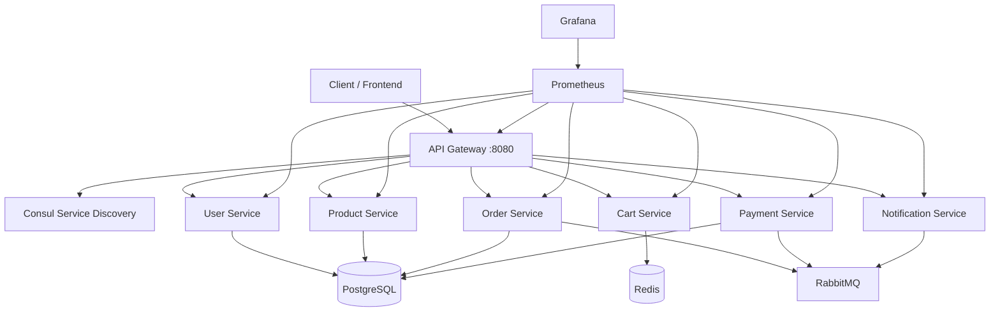

# Scalable E-Commerce Platform

A production-style **microservices e-commerce platform** built with **Node.js**, **Docker**, and **Docker Compose**. Each domain (users, catalog, cart, orders, payments, notifications) runs as an independent service that can be developed, deployed, and scaled on its own.

## Architecture



### Core microservices

| Service | Port | Responsibility |
|---------|------|----------------|
| **User Service** | 3001 | Registration, JWT auth, profiles |
| **Product Catalog** | 3002 | Products, categories, inventory |
| **Cart Service** | 3003 | Redis-backed shopping carts |
| **Order Service** | 3004 | Order placement, status, history |
| **Payment Service** | 3005 | Stripe/PayPal (mock) processing |
| **Notification Service** | 3006 | Email (SendGrid) & SMS (Twilio) mocks |
| **API Gateway** | 8080 | Routing, JWT validation, Consul discovery |

### Platform components

| Component | Technology | Purpose |
|-----------|------------|---------|
| API Gateway | Express + Consul | Single entry point, auth, routing |
| Service discovery | HashiCorp Consul | Dynamic service registration |
| Message bus | RabbitMQ | Async events (`order.created`, `payment.completed`, …) |
| Databases | PostgreSQL (per-service DB) | Persistent storage |
| Cache | Redis | Cart sessions |
| Monitoring | Prometheus + Grafana | Metrics & dashboards |
| Logging | ELK (optional profile) | Centralized log aggregation |
| CI/CD | GitHub Actions | Lint, build, integration smoke tests |

## Quick start

### Prerequisites

- [Docker](https://docs.docker.com/get-docker/) & Docker Compose v2
- (Optional) Node.js 20+ for local frontend development

### Run the platform

```bash
# Clone and start all services (including web UI)
cp .env.example .env
make up
# or: docker compose up -d --build
```

Wait ~60 seconds for services to become healthy, then open:

- **Web storefront:** [http://localhost:5173](http://localhost:5173)
- **API Gateway:** [http://localhost:8080](http://localhost:8080)

```bash
curl http://localhost:8080/health
curl http://localhost:8080/api/products
```

### Two-terminal dev (recommended — same as movie reservation project)

Use **two terminal tabs/windows** from the project root:

**Terminal 1 — Backend** (microservices + API gateway; logs stream here):

```bash
cd /path/to/Scalable-E-Commerce-Platform
cp .env.example .env          # first time only
make dev-backend
```

Wait until you see services listening. API: http://localhost:8080

**Terminal 2 — Frontend** (Vite hot reload):

```bash
cd /path/to/Scalable-E-Commerce-Platform
make dev-frontend
```

Open http://localhost:5173 — Vite proxies `/api` → `http://localhost:8080`

Stop backend: `Ctrl+C` in terminal 1, then `make down` to remove containers.

### All-in-one (Docker only, no separate frontend terminal)

```bash
make up
# UI: http://localhost:5173   API: http://localhost:8080
```

### End-to-end smoke test

```bash
chmod +x scripts/smoke-test.sh
make smoke
```

This script registers a user, adds a product to the cart, places an order, processes payment, and checks notifications.

## API usage (via gateway)

Base URL: `http://localhost:8080`

### Register & login (public)

```bash
curl -X POST http://localhost:8080/api/users/register \
  -H "Content-Type: application/json" \
  -d '{"email":"user@example.com","password":"secret123","firstName":"Jane"}'

curl -X POST http://localhost:8080/api/users/login \
  -H "Content-Type: application/json" \
  -d '{"email":"user@example.com","password":"secret123"}'
```

Use the returned `token` as `Authorization: Bearer <token>` for protected routes.

### Browse products (public)

```bash
curl http://localhost:8080/api/products
curl http://localhost:8080/api/products/categories/list
```

### Cart, orders, payments (authenticated)

```bash
TOKEN="<your-jwt>"
USER_ID="<your-user-id>"
PRODUCT_ID="<product-uuid>"

# Add to cart
curl -X POST "http://localhost:8080/api/cart/$USER_ID/items" \
  -H "Authorization: Bearer $TOKEN" \
  -H "Content-Type: application/json" \
  -d "{\"productId\":\"$PRODUCT_ID\",\"name\":\"Headphones\",\"price\":149.99,\"quantity\":1}"

# Place order
curl -X POST http://localhost:8080/api/orders \
  -H "Authorization: Bearer $TOKEN" \
  -H "Content-Type: application/json" \
  -d "{\"userId\":\"$USER_ID\",\"email\":\"user@example.com\",\"shippingAddress\":{\"street\":\"1 Main St\"}}"

# Pay for order
curl -X POST http://localhost:8080/api/payments/process \
  -H "Authorization: Bearer $TOKEN" \
  -H "Content-Type: application/json" \
  -d "{\"orderId\":\"<order-id>\",\"userId\":\"$USER_ID\",\"amount\":149.99,\"provider\":\"stripe\"}"
```

## Observability

| PostgreSQL (host) | `localhost:5433` | `ecommerce` / `ecommerce_secret` |

> Host port `5433` avoids conflicts if you already run Postgres on `5432`.

| Tool | URL | Credentials |
|------|-----|-------------|
| **Web UI** | http://localhost:5173 | — |
| API Gateway | http://localhost:8080 | — |
| Consul UI | http://localhost:8500 | — |
| RabbitMQ Management | http://localhost:15672 | `ecommerce` / `ecommerce_secret` |
| Prometheus | http://localhost:9090 | — |
| Grafana | http://localhost:3000 | `admin` / `admin` |

### Enable ELK logging

```bash
make logging
# Kibana: http://localhost:5601
```

## Web frontend

React + TypeScript storefront in `frontend/` integrated with all microservices:

| Page | Microservice |
|------|----------------|
| Register / Login / Profile | User Service |
| Product catalog & detail | Product Catalog Service |
| Shopping cart | Cart Service |
| Checkout (2-step) & order history | Order + **Payment** Services |
| **Notifications** inbox | **Notification** Service |
| Order detail — payment info, mark shipped | Payment + Notification Services |

### Payment Service (Stripe & PayPal)

- Checkout step 2: choose **Stripe** (card) or **PayPal** (email)
- Mock mode by default (`STRIPE_MOCK=true`, `PAYPAL_MOCK=true`)
- Live mode: set mocks to `false` and add API keys in `.env` (see `.env.example`)
- Order detail shows transaction ID, card last4, or PayPal email

### Notification Service (SendGrid & Twilio)

Automatic messages via RabbitMQ events:

| Event | Email (SendGrid) | SMS (Twilio) |
|-------|------------------|--------------|
| `order.created` | Order confirmation | If phone on profile |
| `payment.completed` | Payment receipt | — |
| `order.status.updated` | Status update | When status = `shipped` |

View history at **Notifications** in the nav. Demo: open a paid order → **Mark as shipped** to trigger shipping notifications.

## Project structure

```
├── docker-compose.yml          # Full stack orchestration
├── frontend/                   # React storefront (Vite + TypeScript)
├── shared/                     # Common logging, Consul, metrics, messaging
├── gateway/api-gateway/        # API Gateway
├── services/
│   ├── user-service/
│   ├── product-service/
│   ├── cart-service/
│   ├── order-service/
│   ├── payment-service/
│   └── notification-service/
├── infrastructure/             # Postgres init, Prometheus, Grafana, ELK
├── scripts/smoke-test.sh
├── .github/workflows/ci.yml
└── Makefile
```

## Event-driven flows

1. **Order placed** → `order.created` → Notification service sends confirmation email/SMS  
2. **Payment completed** → `payment.completed` → Order service marks order paid; notification sent  
3. **Status update** → `order.status.updated` → Shipping notification  

## Configuration

Copy `.env.example` to `.env` and adjust secrets for production:

- `JWT_SECRET` — signing key for auth tokens  
- `POSTGRES_PASSWORD`, `RABBITMQ_PASSWORD`  
- Set `STRIPE_MOCK=false`, `SENDGRID_MOCK=false`, `TWILIO_MOCK=false` and wire real SDK credentials when going live  

## CI/CD

GitHub Actions (`.github/workflows/ci.yml`) runs on every push/PR:

1. Syntax-check each microservice  
2. Build all Docker images  
3. Spin up the stack and run integration smoke tests  

## Scaling & production notes

- **Horizontal scaling**: `docker compose up -d --scale product-service=3` (register each instance with Consul)  
- **Kubernetes**: Replace Compose with Helm charts; use Ingress instead of the gateway container  
- **Secrets**: Use Docker secrets or a vault; never commit `.env`  
- **Real gateways**: Kong, Traefik, or NGINX can replace the Node gateway for advanced rate limiting and TLS termination  

## License

MIT
